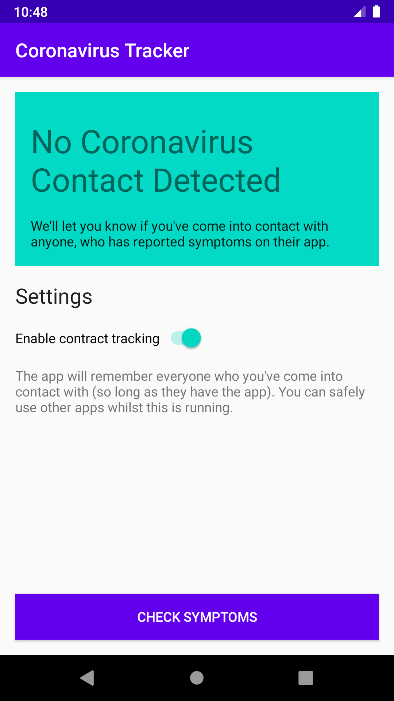
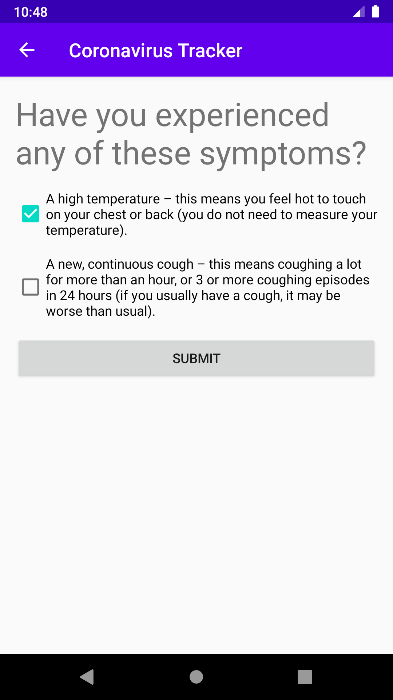
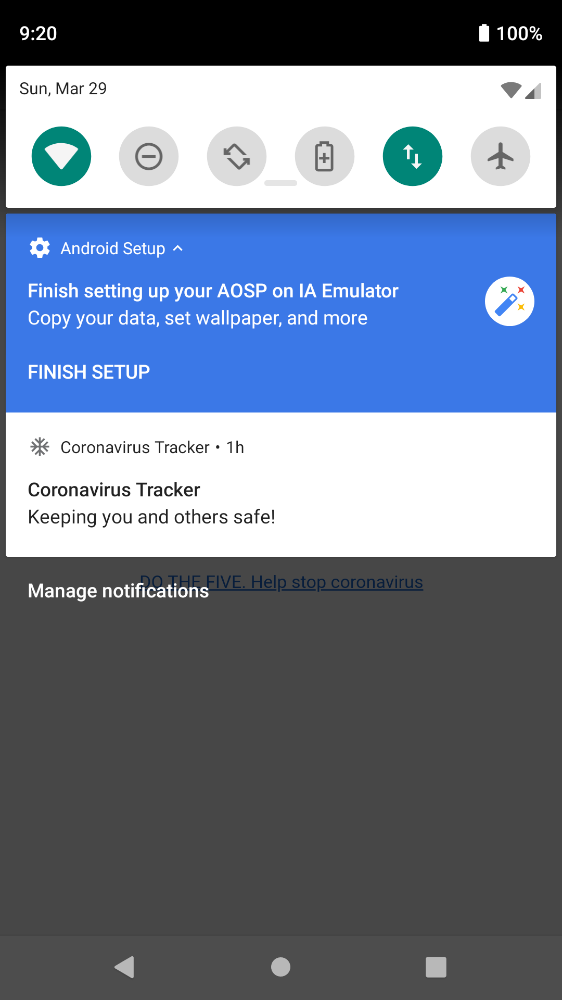

# Coronavirus Tracker

## Automated contact tracing, at scales no longer possible with human detective work

Coronavirus Tracker is an app that allows users to report symptoms. It then traces anyone who they have come into contact with over the past 5 days, and alerts these people to self-quarantine. It is designed to be implemented by governments at country-wide scale.

## How it Works

### Logging all contact

Proximity to other people, who also have the app, is recorded based on three factors:
- Bluetooth signal strength
- Wifi hotspots that both phones can see (cross-triangulation)
- Near-ultrasound audio

When another device is within around 2m of range, the app will simply log how long contact has been maintained for.

### Contact tracing

If a user reports symptoms on their app, anyone who they have had significant contact with (initially 5+ minutes within 2m of proximity), will be advised to self-quarantine. This is done recursively with increasing time-requirements. That is to say, if person A was in contact with person B for 10 minutes, and then person B was in contact with person C for 2 hours, person C will also be told to self-quarantine.

## Data returned to governments/health bodies

Note: All data will be anonymised.

- Number of infected people.
- Average amount of time required to become infected.

## Key challenges

The primary challenge will be to obtain public adoption on a large scale - this will be significantly easier if use is advised by governments or public health bodies.

## Request for collaborators

Please contact alan@skyhookadventure.com if you are capable of authorising this project within your government, or you are able to collaborate in any other way.